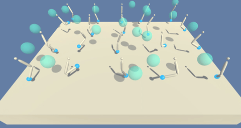
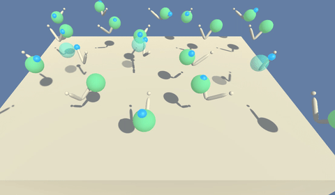

# DDPG-for-Udacity-Continuous-control

My solution to the continuous control project of Udacity's Deep Reinforcement Learning Nanodegree

See the [report](report.md) for more information on the algorithm and implementation.

## Project details
This project is part of the Udacity Deep Reinforcement Learning nanodegree.
The goal of this project is to solve the Reacher environment. In this environment, a double-jointed arm can move to target locations. A reward of +0.1 is provided for each step that the agent's hand is in the goal location. Thus, the goal of your agent is to maintain its position at the target location for as many time steps as possible.

The observation space consists of 33 variables corresponding to position, rotation, velocity, and angular velocities of the arm. Each action is a vector with four numbers, corresponding to torque applicable to two joints. Every entry in the action vector should be a number between -1 and 1.

The environment is considered solved if a reward of +100 is obtain for 30 consecutive episodes.

Iam using an actor-critic algorithm called Deep Deterministic Policy Gradients (DDPG) algorithm. A link to the paper can be found [here](https://arxiv.org/pdf/1509.02971.pdf)

## untrained vs trained agents

## Getting started
1. To set up your Python environment correctly follow [this link](https://github.com/udacity/deep-reinforcement-learning#dependencies).

2. To download the Unity Environment follow:
	- [This link](https://s3-us-west-1.amazonaws.com/udacity-drlnd/P2/Reacher/Reacher_Linux.zip) for Linux
	- [This link](https://s3-us-west-1.amazonaws.com/udacity-drlnd/P2/Reacher/Reacher.app.zip) for OSX
	- [This link](https://s3-us-west-1.amazonaws.com/udacity-drlnd/P2/Reacher/Reacher_Windows_x86.zip) for Microsoft 32 bits
	- [This link](https://s3-us-west-1.amazonaws.com/udacity-drlnd/P2/Reacher/Reacher_Windows_x86_64.zip) for Microsoft 64 bits
(For Windows users) Check out this link if you need help with determining if your computer is running a 32-bit version or 64-bit version of the Windows operating system.

3. Clone the repo and add the environment files to it.

4. Run the training or validation from within the [jupyter notebook](ddpg_train.ipynb).
