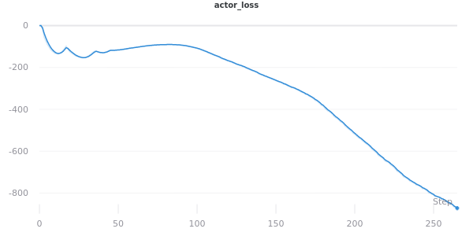

## DDPG for continuous control
This is a report on project 2 of the deep reinforcement learning nanodegree from udacity.
The Deep Deterministic Policy Gradient (DDPG) algorithm is used for solving this rather complex continuous control task. See the [original paper](https://arxiv.org/pdf/1509.02971.pdf) by Lilicrap et al. for more information

##### Initial environment with randomly acting agents


#### 1. The Environment
- The goal of the project is to teach a double-jointed arm to move / follow to specific locations in 3D space
- A reward of +0.1 is given to an agent for every time step that the outer part of the arm meets the goal location
- The Env comes in 2 variations. The first has only a single agent, the second one has 20 agents. We use the second version to make use of distributed training and reduce training time by a huge factor.
- Vector Observation space: 33 variables corresponding to position, rotation, velocity, and angular velocities of the double-jointed arm.
- Vector Action space: (Continuous) Each action is a vector with four numbers, corresponding to torque applicable to two joints. Every entry in the action vector should be a number between -1 and 1.
- the env is considered solved after reaching a mean reward of 30+ over the past 100 runs.

#### 2. The Algorithm
- The DDPG algorithm is used as it it specifically designed for a continuous action space and comes with great sample efficiency due to its off-policy nature
- It allows for the use of an experience buffer which greatly stabilizes training
- Despite the original paper advocating an Ornstein-Uhlenbeck process to add noise for exploration, we settle for a simple noise sampled from a normal distribution with mean=0 and std=1. 
- Algorithm specific Hyperparameters:
    - batch_size = 64
    - gamma = 0.99
    - buffer_size = 500.000
    - noise_factor = 1.0
    - noise_decay = 0.999
    - noise_minimum = 0.0001
    - buffer_threshold = 0.1
    - train_every_n = 4
    - model_update_every_n = 8
    - tau = 0.01
    - lr_actor = 1e-4
    - lr_critic = 1e-3
- Exploration strategy:
  - We start with a random noise of 1.0 and decay it every step by a factor of 0.999 until it reaches the noise_minimum
  - We start training only after the buffer is at a minimum capacity of 100*buffer_threshold % to to avoid overfitting on early training examples


#### 3. Network Architecture
- A simple feed forward network is used for both actor and critic network
- Both nets have 2 hidden layers, params are (n_inputs, 256, 256, n_outputs)
- Both nets use the Adam optimizer with default values for beta. The gradients are clipped with a value of 1.0. We use ReLu functions in all layers except the outputs.
- The actor output layer uses a tanh function to keep the values between -1 and 1. The critic output has no activation function to not constrain the differentiation between state values.

#### 4. Implementaion
- We make use of a simple wrapper to allow for a functionality coherent with the open ai gym package. Helps with readibility and is more familiar than ml-agants.

```python
class EnvWrapper:
    """A wrapper for the unity environment which implements functionalies similar to openai gym
    Params
    ======
        path(string): relative/absolute path to env executable
    """
    def __init__(self, path, no_graphics=True):
        self.env = UnityEnvironment(file_name=path, no_graphics=no_graphics)
        self.brain_name = self.env.brain_names[0]
        self.brain = self.env.brains[self.brain_name]
        self.env_info = None
        self.reset()

        self.action_space = self.brain.vector_action_space_size
        self.observation_space = self.env_info.vector_observations.shape[1]

    def step(self, actions):
        self.env_info = self.env.step(actions)[self.brain_name]
        next_state = self.env_info.vector_observations
        reward = self.env_info.rewards
        done = self.env_info.local_done
        return next_state, reward, done, None

    def reset(self):
        self.env_info = self.env.reset(train_mode=True)[self.brain_name]
        return self.env_info.vector_observations
```
- [utils.py](utils.py) also implements the experience buffer which is responsible for storing and sampling (s,a,r,d,s').
- [models.py](models.py) implements the simple feed forward models.
- For an implementation of the training loop, please view the provided [jupyter notebook](ddpg_train.ipynb). 

#### 4. Results

- The provided graphics below show the results for the rewards and losses
- using the provided hyperparameters we achieve a very stable training process and solve the env after 256 episodes (although this technically means 256 * 20 agents)





#### 5. Final result
- result of the trained agent

[](data/reacher_trained.gif)

#### 6. Future improvements
The following improvements come to mind that might be able to tweak the algorithm further and reduce training time / increase convergence
- Exploration strategy:
  - Since exploration strategies are not an exact science there is a great deal of possibilities that can be tried to enhance exploration in early stages. The simplest approach would be to run a hyperparameter optimization over the current configuration albeit compute intensive. Another approach might be to remove the buffer threshold and try different values for noise_factor and noise_decay. Even fixed noise_factors might be possible.
  - Introducing a dynamic experience_buffer size could be an interesting idea.
- Model complexity:
  - Trying different architectures, adding batch / layer normalization
  - Using a single network (sharing parameters in early layers) with 2 output heads
- Env:
  - Changing the reward structure of the underlying env, eg. introducing neg. points 
